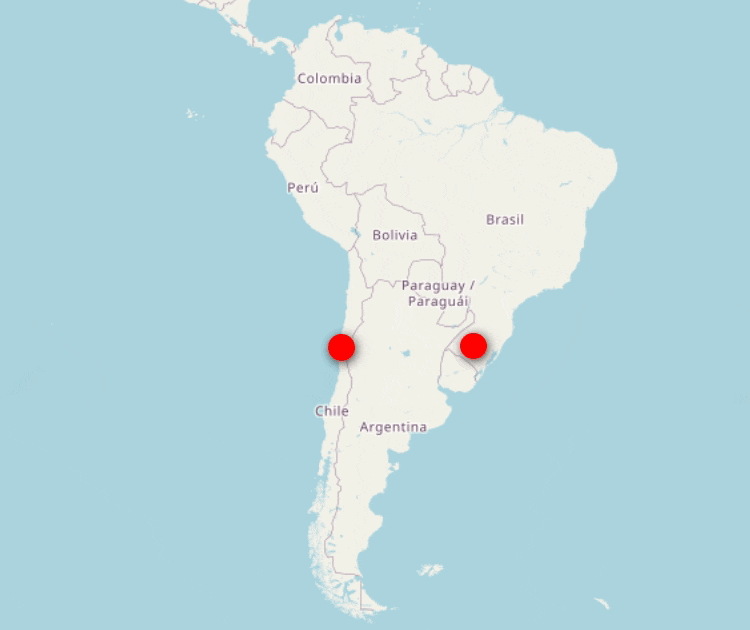

+++
title = "Sobre"
+++

#### Collaborative Online International Learning (COIL)

---

🇧🇷 COIL é uma modalidade de ensino/aprendizagem online colaborativa entre professores e alunos em disciplinas curriculares com conteúdo comum. 

Os projetos de software nesta galeria foram desenvolvidos na modalidade COIL entre as disciplinas:
- ELC1074 - Projeto de Software II, para os cursos de Ciência da Computação e Sistemas de Informação da Universidade Federal de Santa Maria (UFSM), Brasil, e
- TIHI63 - Proyecto de Integración, para o curso de Ingenieria Informática do Instituto Nacional de Capacitación Profesional de Chile (INACAP), Chile.

Cada projeto partiu da identificação de um problema e gerou uma solução de software, que foi desenvolvida em grupo binacional, usando tecnologias alinhadas com os objetivos. Todos os projetos passaram por testes com usuários/colegas do Brasil e do Chile.

Os professores envolvidos foram: Andrea Schwertner Charão (UFSM), Jorge Luis Alejandro Cortés Gallardo (INACAP), Celio Trois (UFSM) e Mário Astudillo (UFSM-INACAP).

---

🇨🇱 COIL es una modalidad de enseñanza/aprendizaje en línea colaborativa entre profesores y estudiantes en asignaturas curriculares con contenido común.

Los proyectos de software en esta galería fueron desarrollados en la modalidad COIL entre las asignaturas:
- ELC1074 - Proyecto de Software II, para las carreras de Sistemas de Información y Ciencia de la Computación de la Universidade Federal de Santa Maria (UFSM), Brasil, y 
- TIHI63 - Proyecto de Integración, para la carrera de del Instituto Nacional de Capacitación Profesional de Chile (INACAP), Chile.

Cada proyecto comenzó con la identificación de un problema y generó una solución de software, desarrollada en grupo binacional utilizando tecnologías alineadas con los objetivos. Todos los proyectos fueron probados por usuarios/colegas de Brasil y Chile.

Los responsables del COIL fueran: Andrea Schwertner Charão (UFSM), Jorge Luis Alejandro Cortés Gallardo (INACAP), Celio Trois (UFSM) y Mário Astudillo (UFSM-INACAP).