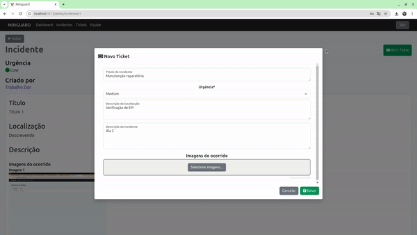

+++
showonlyimage = false
draft = false
date = "2024-11-28 19:24:03.345865"
image = "thumbnail.png"
title = "MinGuard"
weight = 3
+++

Registro e tratamento de incidentes reportados em ambientes de mineração / Registro y tratamiento de incidentes reportados en entornos de minería

<!--more-->

## Descrição / Descripción

🇧🇷 Registro e tratamento de incidentes reportados em ambientes de mineração

🇨🇱 Registro y tratamiento de incidentes reportados en entornos de minería

Apresentação / presentación: 
Coming soon

---

## Acesso / Acceso

Link: 
https://minguard.netlify.app/login

Roteiro para testes / guion para pruebas: 
[link](https://docs.google.com/document/d/1TR227UmYgA-8I97WvnaMs2oBpyiqYHvk7aeb_0v6OI8/edit?usp=sharing)

---

## Desenvolvimento / Desarollo

##### Tecnologias / Tecnologías

- Front-end: Javascript, ReactJS
- Back-end: Java, Spring Boot, PostgreSQL, Docker
- Deploy: Netlify (front-end), AWS (back-end)

##### Repositórios

- Repositório back-end: [link](https://github.com/brasil-chile-connection/minguard-be)
- Repositório front-end: [link](https://github.com/brasil-chile-connection/minguard-fe)

##### Outros links:
- Repositório app: [link](https://github.com/brasil-chile-connection/minguard-app)
- Diagrama ERD: [link](https://github.com/brasil-chile-connection/minguard-be/tree/main/src/main/resources/docs)

---

## Equipe / Equipo

- Alvaro Araya Ramirez (INACAP)
- Axel Gomez Bravo (INACAP)
- Gilson Garcia da Silva Junior (UFSM)
- Luana Ferreira Oliveira (UFSM)
- Roberto José Mahl (UFSM)
- Prof. Celio Trois (UFSM) / Prof. Jorge Gallardo (INACAP)

