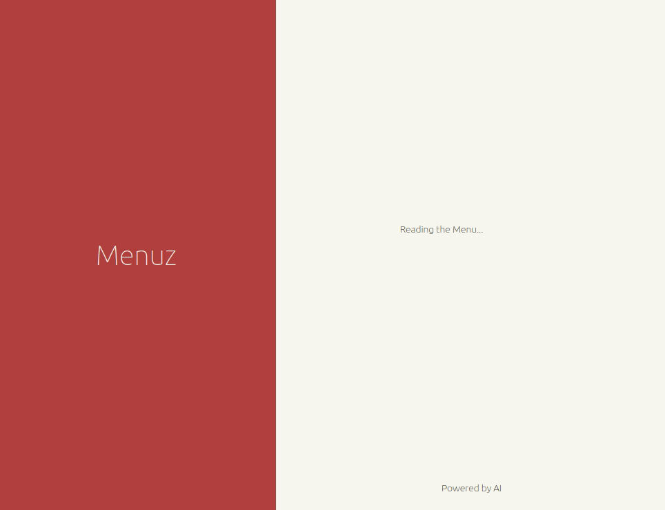

+++
showonlyimage = false
draft = false
date = "2024-11-28 19:24:03.349366"
image = "mockuper-menuz.png"
title = "Menuz"
weight = 4
+++

Tradutor e interpretador de cardápios / Traductor e intérprete de menús

<!--more-->

## Descrição / Descripción

🇧🇷 O Menuz é um aplicativo Web que permite aos usuários fazer upload de uma foto de um cardápio para traduzir o conteúdo e receber uma breve descrição sobre o sabor e os ingredientes dos pratos. Além de superar barreiras linguísticas, a aplicação fornece um contexto cultural e culinário, ajudando viajantes e imigrantes a fazer escolhas informadas em restaurantes, enriquecendo sua experiência gastronômica.

🇨🇱 Menuz es una aplicación web que permite a los usuarios subir una foto de un menú para traducir el contenido y recibir una breve descripción sobre el sabor y los ingredientes de los platos. Además de superar las barreras del idioma, la aplicación proporciona un contexto cultural y culinario, ayudando a viajeros e inmigrantes a tomar decisiones informadas sobre restaurantes, enriqueciendo su experiencia gastronómica.

Apresentação / presentación: [Link](https://docs.google.com/presentation/d/1yjYb7Ij8HtfcS6D1ixhdPGn1bdyxIkguMcnUzK-rJ08/edit#slide=id.p)

---

## Acesso / Acceso

App Menuz: [Link](https://ai-menuz.vercel.app/)

🇧🇷 Sugerimos ir até um restaurante para testar nossa aplicação! Se não for possível, você pode encontrar imagens em sites como [Pinterest](https://uk.pinterest.com/search/pins/?q=food%20menu%20ideas), [Pexels](https://www.pexels.com/search/menu/) ou [Unsplash](https://unsplash.com/s/photos/menu)

🇨🇱 ¡Te sugerimos ir a un restaurante para probar nuestra aplicación! Si eso no es posible, puedes encontrar imágenes en sitios como [Pinterest](https://uk.pinterest.com/search/pins/?q=food%20menu%20ideas), [Pexels](https://www.pexels.com/search/menu/) ou [Unsplash](https://unsplash.com/s/photos/menu)

Roteiro para testes / guion para pruebas: [Link](https://docs.google.com/forms/d/e1FAIpQLSdxofVBbKDtLei-Ig36MK9k0c1P10BRSumcWJxycwggbDwRTA/viewform?usp=header)

---

## Desenvolvimento / Desarollo

##### Tecnologias / Tecnologías

- Front-end: NextJS, Typescript, MUIComponents.
- Back-end: Não foi utilizado. Integração feita diretamente do FrontEnd.
- AIs: OCR, GoogleGenerative (Gemini), GoogleTranslate.
- Deploy: Vercel.
- Banco de Dados: AWS S3 Bucket.

##### Repositórios

- Repositório BackEnd: Não utilizado. Integração feita diretamente do FrontEnd.
- Repositório FrontEnd: [Link](https://github.com/LauraBoemo/ai-menuz)

##### Outros links

- [Protótipo Inicial](https://www.figma.com/design/pWDpORfqqWRBRzlXvbXQB8/PS2-MyMenu?node-id=0-1&t=mVIxXVE1sQvk5TpP-1)
- [Arquitetura](https://www.figma.com/board/v1btaJf9OBQshaci5NPnrK/PS2-Archtecture-MyMenu?t=mVIxXVE1sQvk5TpP-0)

---

## Equipe / Equipo

- Aleister Alexis Alarcón Vera (INACAP)
- Laura Rigui Boemo (UFSM)
- Mariana Lopes Pillon (UFSM)
- Tomás Benjamín Sepúlveda Oñate (INACAP)
- Profª Andrea Charão (UFSM) / Prof. Jorge Gallardo (INACAP)
