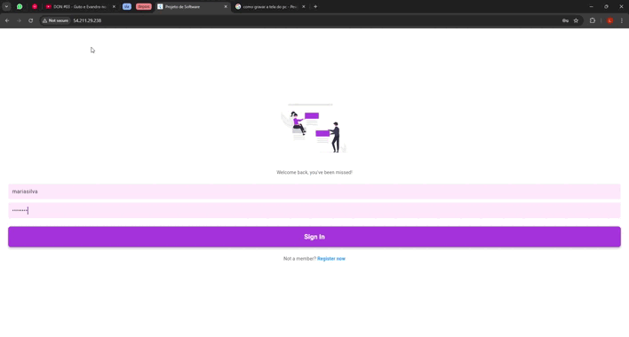

+++
showonlyimage = false
draft = false
date = "2024-11-28 19:24:03.353194"
image = "822ed1c0-41cb-44d0-8514-2e312e9e42e0.jpg"
title = "Study.io"
weight = 5
+++

Rede social para estudo / Red social para estudio

<!--more-->

## Descrição / Descripción

🇧🇷 Study.io é uma plataforma que permite aos usuários, por meio de um feed comum, que compartilhem seus resumos, exercícios e/ou atividades de estudos. Além disso, também poderão votar e discutir sobre os conteúdos postados por outros utilizadores da plataforma. 

🇨🇱 Study.io es una plataforma que permite a los usuarios compartir sus resúmenes, ejercicios y actividades de estudio a través de un feed común. Además, ofrece la posibilidad de votar y discutir sobre los contenidos publicados por otros usuarios de la plataforma. 

Apresentação / presentación: preencha aqui o link para slides da apresentação final do projeto

---

## Acesso / Acceso

Link: [http://54.211.29.238/](http://54.211.29.238/)

Roteiro para testes / guion para pruebas: 
https://forms.gle/Pt4b9hFaURy3CqmX7

---

## Desenvolvimento / Desarollo

##### Tecnologias / Tecnologías

- Front-end: Flutter, Dart
- Back-end: Django, Django Rest Framework, django-cors-headers, MySQL
- Deploy: AWS/front, AWS/back

##### Repositórios

- https://github.com/Luissiqueri/projetoDeSoftware (private)
- repositório frontend

##### Outros links:
- preencha aqui algum link importante sobre o desenvolvimento (documento de visão, diagramas, etc.)
- preencha aqui algum link importante sobre o desenvolvimento (documento de visão, diagramas, etc.)

---

## Equipe / Equipo

- Francisco Contreras Araya (INACAP)
- Luis Henrique Siqueri Dias (UFSM)
- Maria Clara Bohn Silva (UFSM)
- Gonzalo Andres Contreras Araya (INACAP)
- Profª Andrea Charão (UFSM) / Prof. Jorge Gallardo (INACAP)

